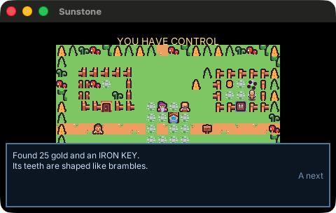
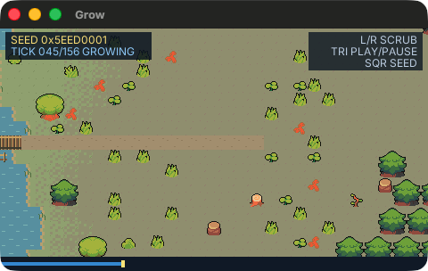

# pocket-rpgkit

A reusable 2D tile-RPG runtime and the **`rpgkit-project/v1`** data format,
built on [PocketJS](https://github.com/pocket-stack/pocketjs). It contains
the parts an RPG-Maker-style game needs without any specific game:

- **pure-TS engine** (`src/engine/`) — tile movement and collision, the
  event interpreter (pages, triggers, 15 commands), map-character motion,
  multi-map sessions, deterministic save snapshots. No host imports, no
  wall clock, no `Math.random`: a session is one pure fold per virtual
  frame, so a button tape replays byte-for-byte on every host;
- **Solid UI components** (`src/ui/`) — `GameView`, a complete game screen
  for a project (chunked maps, follow camera, NPCs, dialog, fades, and
  optional attract mode), plus the blocks it is made of: `DialogBox`,
  `PlayerSprite`, `ChunkLayer`, `SaveMenu`, `Panel`. The framed ones take a
  colour theme, and `DialogBox` shows speaker portraits;
- **attract mode** (`src/engine/attract.ts`) — after 10 idle seconds a
  recorded playthrough replays from a clean world; any button takes over
  on that very frame, **L** rewinds 3 virtual seconds, **SELECT** hands
  the session back to the demo. Demo and player input are one u16 stream,
  so rewind undoes the player's moves exactly like the tape's;
- **host adapters** (`src/host/`) — the `data.fs` save slot store and the
  attract-tape override loader;
- **build-time asset pipelines** (`tools/lib/`) — tile sheets to baked
  512px PSM_4444 canvases and chunks, static walker frames, and the
  `GameAssets` manifest a game mounts;
- **the format** (`src/data/schema.json`, v1; changes recorded in
  `src/data/CHANGELOG.md`);
- **three examples** (`examples/`), each a PocketJS app with its own art
  and tests on the wasm sim host (below);
- **a tile-map editor, in preview** (`editor/`): paints the examples'
  documents on the desktop host ([below](#editor-preview)).

## Examples

| | |
| --- | --- |
|  |  |
| **`examples/sunstone`** — *The Sunstone of Bramble Hollow*, a three-map RPG (village → forest → cave: key chest, rune stone, thorn and iron gates, the relic). Idle for 10 s and it plays itself from a frozen 539-frame winning tape; press any button to take over mid-demo, **L** to rewind. | **`examples/grow`** — four settlements grow to the right from one seeded rule set (roads, homes, fields, residents) through grass, mud, sand and snow. Scrub the timeline (**L/R**, touch, or mouse drag) to any tick — each is a pure re-grow — **SQUARE** for a new seed, **CIRCLE** to walk into the finished village, which is played as a generated `rpgkit-project/v1` document. |

On the macOS desktop host (`bun run desktop sunstone`, `bun run desktop
grow`; Metal, captured on an Apple M5 Pro):

| | |
| --- | --- |
|  |  |

**`examples/meadow`** is the minimal example: one 20×12 map and four
events proving the package boots, renders, replays deterministically,
and round-trips on the PocketJS wasm sim host.

Everything runs on a fixed 60 Hz virtual-time reference: a host at 30,
20 or 4 Hz folds 2, 3 or 15 reference ticks per frame, so the world at a
given virtual moment is the same at every rate (the journey tests drive
each example's winning run at 60/30/20/4 Hz and compare milestones).

The runtime pins PocketJS with a git submodule at
`vendor/pocketjs` (commit recorded in `git submodule status`).

## Play in the browser

The examples play in the browser at
**<https://lfkdsk.github.io/pocket-rpgkit/>**. Each page runs the example's
bundle on the PocketJS core compiled to WebAssembly: the same bundle and
core the sim tests use. Click the game (it also takes the keyboard when the
page loads), then use the arrow keys and **A**/**Enter**/**Z** to confirm.
Each page lists the rest of its controls. Grow's timeline also takes a mouse
or touch drag, and phones get on-screen buttons.

To build the site locally (no dev server; any static file server works):

```sh
bun run build:wasm                      # once: the wasm core
bun run web                             # dist/web: landing page + one page per example
python3 -m http.server -d dist/web 8000 # then open http://localhost:8000/
bun tools/web-verify.ts                 # optional: play every page in headless Chrome
```

`bun run web` builds every example in `EXAMPLES`
(`tools/build-example.ts`), and `bun run web grow` builds one. Each example
is resolved against the `web-app` target from its `pocket.json`. Card text,
preview images and controls come from `web.json`. An example without an
entry still gets a card: its `pocket.json` title, default controls, and a
preview rendered from its own bundle. Every URL is relative, so the site
works under any path. `.github/workflows/pages.yml` publishes `dist/web` to
GitHub Pages on every push to `main`.

A game that vendors this kit builds its own site the same way, for example
Alpine Post:

```sh
bun vendor/pocket-rpgkit/tools/web.ts --project-root . alpine-post
```

## Quick start

```sh
git clone --recurse-submodules https://github.com/lfkdsk/pocket-rpgkit.git
cd pocket-rpgkit
bun install
bun test                 # reducer/format/controller suites; sim cases skip
bun run build:wasm       # one-time: compile the vendored sim core
bun run build:example    # build meadow, sunstone, grow, the editor and test fixtures into dist/
bun test                 # 519 tests incl. sim journeys and pixel goldens
bunx tsc --noEmit        # typecheck, exit 0
bun run desktop sunstone # build for the desktop host and open a window
                         # (also: grow, meadow; needs a Rust toolchain)
bun run web              # the browser site in dist/web (see above)
```

On a Mac, `bun run package:macos sunstone` (or `grow`, `meadow`) makes a
double-clickable `dist/macos/<Name>.app` plus a zip to hand around: the
desktop host, the example's bundle and pak, an icon cropped from its
golden frame, and the licenses. It is built for the Mac's own
architecture and ad-hoc signed, not notarized, so a downloaded copy opens
the first time with right-click > Open (or Privacy & Security > Open
Anyway). A game that vendors this kit packages itself with
`bun vendor/pocket-rpgkit/tools/package-macos.ts --project-root .`
(`--name`, `--icon <png>`, `--icon-crop x,y,w,h` to taste).

`bun run build:example sunstone` builds one example. `bun run gen-assets`
regenerates every example's baked art from its `assets/src/` (and then the
editor's tile cells from those sheets); the cookers are deterministic and
reproduce the committed PNGs byte for byte.

## Editor (preview)

`editor/` is a tile-map editor for `rpgkit-project/v1` documents, a
PocketJS app on the desktop host. It opens the Sunstone and Meadow
documents (`examples/*/data/*.json`) and paints them with those examples'
own Kenney tile sheets.

What it does today:

- paint ground tiles by click or drag; a **LAYER** toggle paints the
  sparse upper (star) layer instead; right click or shift+click erases;
- undo/redo, one step per stroke, 64 steps deep (header buttons or
  Cmd+Z / Cmd+Shift+Z);
- switch between a document's maps; the palette shows the sheets the
  current map declares;
- save through the schema validator (`src/data/schema.json`): an invalid
  export is refused with its first error, an unedited one saves back byte
  for byte;
- draw every event as a marker on its cell.

Not yet: editing events (placing, moving, pages, commands), passage
overrides, map properties, or creating maps. The grow example's generated
settlement is not wired in: its sheet is synthesized by its cooker rather
than cut from a source PNG.

```sh
bun run editor                    # Sunstone, on a working copy in dist/editor/
bun run editor meadow             # Meadow
bun run editor sunstone --file my-map.json   # another file (seeded if missing)
bun run editor --build-only       # bundle + release host, no window
```

The launcher builds `dist/<target>/editor.{js,pak}` and the Rust host,
then opens the window with the `rpgkit-editor` companion and `--file`: the
host forwards the real mouse and keyboard and writes each save to that
file, by default a working copy in `dist/editor/` seeded from the
example (the example games build their documents from code, and
`bun run gen-assets` rewrites `data/*.json`). Without the companion (the wasm sim,
a browser) the editor runs from buttons behind a visible banner.
`bun run build:editor` builds the sim bundle alone; the editor's tests are
`tests/editor-model.test.ts` and `tests/editor-sim.test.ts`. More in
[`editor/README.md`](editor/README.md); the tile art's licenses are in the
examples' `ATTRIBUTION.md` files.

## The format in one screen

A project document (`"format": "rpgkit-project/v1"`) names a `start` tile,
tile `sheets`, `items`, and `maps`. A map has a dense row-major `ground`
array of `"sheet.cell"` tile ids (`null` is a blocking void), a sparse
`upper` star layer drawn above characters, sparse `passage` overrides, and
`events`. Each event owns ordered **pages**; the active page is the
highest-index page whose condition holds. A page names one trigger, an
optional sprite, motion (`moveType` or an authored `moveRoute`), and a
command list. `src/data/schema.json` is normative and
`src/engine/types.ts` carries the matching TypeScript types.

### The 15 commands

| op | purpose |
| --- | --- |
| `text` | typewriter dialog lines |
| `choices` | prompt with option branches and an optional cancel branch |
| `switch` | set a global switch |
| `variable` | set/add/sub or a seeded random range |
| `selfSwitch` | set the event-local A/B/C/D flag |
| `if` | condition over switch/variable/selfSwitch/item/gold, with `else` |
| `transfer` | swap maps at x/y/dir, with an optional fade |
| `moveRoute` | force the player or this event through a step list |
| `wait` | virtual-time pause (seconds, compiled against `simulationHz`) |
| `gold` | add/sub gold |
| `item` | add/remove an item count |
| `se` | emit a sound cue the host drains |
| `erase` | remove this event for the rest of the map visit |
| `exit` | end this fiber |
| `common` | run a common event's command list |

Triggers: `action` (confirm on the faced or occupied tile),
`playerTouch` (on cell entry), `autorun` (blocking, restarts after it
finishes), `parallel` (concurrent fiber per active page). Conditions
compile to forward jumps; no command can express a loop, and the runtime
backstops a hand-crafted cyclic program with a fatal interpreter error
instead of hanging the frame loop.

## Using it in your own project

The published package exports the engine surface (`pocket-rpgkit`), the
Solid components (`pocket-rpgkit/ui`), the host adapters
(`pocket-rpgkit/host`), and the schema (`pocket-rpgkit/schema`). The
in-repo examples import the sources relatively, because PocketJS's build
pass 1 walks relative imports; `examples/meadow/meadow.tsx` shows the
reducer loop by hand:

```ts
import { createSession, startSession, stepSession } from "pocket-rpgkit";
import { DialogBox, PlayerSprite } from "pocket-rpgkit/ui";

const session = createSession(project, simulationHz());
let state = startSession(project, session);
onFrame((buttons) => {
  state = stepSession(session, state, { buttons, confirmEdge, /* ... */ });
  // state.move / state.chars / state.interp drive the Solid tree.
});
```

and `examples/sunstone/sunstone.tsx` mounts the whole screen:

```tsx
import { GameView } from "pocket-rpgkit/ui";
import { loadAttractTape } from "pocket-rpgkit/host";

mount(() => (
  <GameView project={project} assets={GAME_ASSETS}
            attractTape={loadAttractTape(DEMO_TAPE_RUNS).masks} />
));
```

A game supplies its own project document, its own baked art (the
`tools/lib/chunks.ts` pipeline turns its sheet PNGs into map chunks and
writes the `GameAssets` manifest), and its own walker frames; the
components name no asset paths themselves. To give a game attract mode,
write a deterministic journey driver (`examples/sunstone/journey.ts`;
`searchWalk` in `src/engine/journey-search.ts` plans the walks on hosts
slower than 60 Hz), freeze its 60 Hz masks as an RLE tape, and pass the
tape to `GameView`. On a host with `data.fs`, an `attract-tape.json` at
the app's data root replaces the built-in tape without a rebuild.

Saves are FNV-checksummed envelopes over a safe-point snapshot (mover on a
tile boundary, no modal, no parked request). Hosts with `data.fs` write
three slots through `src/host/save-fs.ts`; other hosts exchange the same
envelope as URL-safe base64 text (the save code).

### Themes and speaker portraits

`DialogBox`, `SaveMenu` and `GameView` take an optional `theme`, a
`Partial<UiTheme>`; keys left out keep the kit's navy look. `DialogBox` and
`GameView` also take `faces`, a table from speaker name to portrait:

```tsx
import { GameView, type UiTheme } from "pocket-rpgkit/ui";

const PARCHMENT: Partial<UiTheme> = {
  border: "#7a4a2a", // outer 2 px frame; fill of the name tab
  rim: "#e8a050",    // optional 1 px ring inside the border
  paper: "#f4ecd8",  // panel fill; text of the name tab
  ink: "#302820",    // body text
  dim: "#8a6040",    // prompts, legends, hints
  accent: "#c03020", // titles, the selected row
};
const FACES = {
  KEEPER: "assets/face/keeper.png", // 64x64 PNGs
  CLERK: "assets/face/clerk.png",
};

mount(() => <GameView project={project} assets={GAME_ASSETS} theme={PARCHMENT} faces={FACES} />);
```

A text whose first line starts with `NAME: ` (`/^([A-Z][A-Z]+): /`) for a
name in `faces` shows that portrait left of the text and a `Name` tab on
the box's top edge. The prefix is never typed: the interpreter still
counts it, so the reveal is offset by its length and the words start after
a short beat with the portrait already up. Any other line, including
`MAYOR: ...` when `MAYOR` has no face, renders exactly as it would without
`faces`. Pak images are power-of-two and at most 512 px, so portraits are
64×64; a game that draws a smaller face inside that canvas narrows the
column with `faceWidth` (default 72: the image plus an 8 px gap). As with
every image, the paths must appear as full string literals in the game's
sources so the build bakes them.

`SaveMenu` also takes a `title` for its root page. `Panel` is the frame
both components draw (border, optional rim, paper), for a game's own
screens such as a help page. `resolveUiTheme` and `splitSpeaker` are plain
TypeScript and are exported from `pocket-rpgkit` as well.

## Target matrix

The engine is host-free TypeScript; the targets below describe what the
PocketJS app using it can run on. The examples declare the fixed 480×272
viewport plus a live dynamic viewport on desktop hosts, where `GameView`
letterboxes small maps and follows the player on large ones.

| host | runtime | notes |
| --- | --- | --- |
| `linux-app` / `macos-app` | PocketJS desktop host | `data.fs` save slots; resizable logical viewport letterboxes per `centerOffset` |
| `web-app` (wasm) | wasm core, `tools/web.ts` player pages | same bundle; save codes when no fs mount |
| sim (`hosts/sim`) | wasm core, headless | deterministic tapes and framebuffer hashes; the example suites run here |
| `psp` | PSP core | not gated by this repo; the vendor build's `pocket check --target psp` is the admission path for a consuming app (512px baked canvases, PSM_4444) |

## Repository layout

```
src/engine/      pure runtime (types, motion-clock, movement, passability,
                 interpreter, chars, session, camera, viewport, tiles,
                 save*, schema-validate, attract, tape, journey-search)
src/data/        schema.json (normative) + CHANGELOG
src/ui/          GameView, ChunkLayer, DialogBox, PlayerSprite, SaveMenu,
                 Panel, theme (UiTheme, speaker prefixes)
src/host/        data.fs save adapter, attract-tape loader
tools/lib/       game-agnostic baking pipelines (bake.ts, chunks.ts) and
                 the desktop-host build/launch helper (desktop.ts)
tools/           example/editor build driver, desktop and editor launchers,
                 macOS packager (package-macos.ts), web site builder
                 (web.ts, web/, web-verify.ts)
examples/        meadow (minimal), sunstone (game + attract), grow (demo);
                 each has its entry, data, assets/src, gen-assets.ts,
                 images.json, pocket.json and ATTRIBUTION.md
editor/          tile-map editor (preview): app, engine/, ui/, its cooker
                 and the tile cells it bakes from the examples' sheets
tests/           unit suites, sim suites, goldens/, fixtures/ (small
                 apps the sim suites boot, built by build:example)
vendor/pocketjs  pinned PocketJS submodule
```

## License

MIT (`LICENSE`). Example art: Kenney Tiny Town and Tiny Dungeon (CC0 1.0),
Pixel-Boy and AAA's Ninja Adventure (CC0 1.0), and Lanea Zimmerman
(Sharm) Tiny 16 (**CC-BY 3.0**, attribution required) — see each
example's `ATTRIBUTION.md`. The editor's tile cells are cut from the
Sunstone example's Kenney sheets (CC0).
